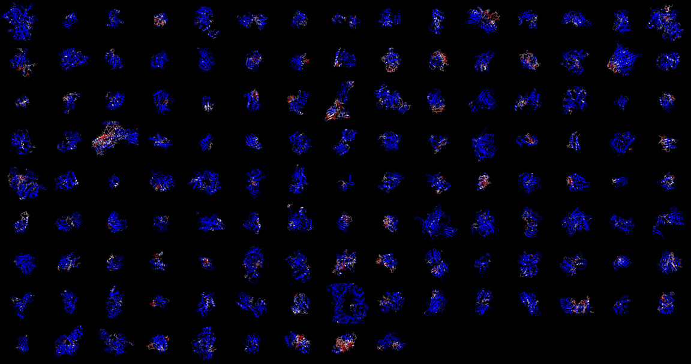

# Dataset for training predictors of regions of pocket-related changes in proteins

## Idea

Prepare protein structure-based data suitable for training graph neural networks to predict
what residues in a protein structure are likely to change conformation when pocket opening happens (apo-to-holo transition).
Here, 'apo' means a protein with at least one inactive and partially or completely closed pocket, 'holo' means a protein with at least one pocket where a ligand can fit.

## Raw data source

129 unique apo-holo pairs of protein identifiers were collected from two publications: [CryptoSite](https://pubmed.ncbi.nlm.nih.gov/26854760/) and [PocketMiner](https://pubmed.ncbi.nlm.nih.gov/36859488/).
Every identifier consists of a PDB entry ID and a chain name.
Identifiers for all the pairs are listed in the [table](processes/prepare_pairs_of_structures/output/candidate_pairs.txt).

## Downloaded and prepared PDB structures

All pairs of structures were downloaded from [PDB](https://www.rcsb.org) and stripped of all non-protein atoms.
For every pair, the Voronota-JS-based [script](processes/prepare_pairs_of_structures/prepare_pair_of_structures.bash) was applied to make apo and holo structures have the same sequence and the same residue numbering.
The prepared PDB structures are in [processes/prepare_pairs_of_structures/output/structures](processes/prepare_pairs_of_structures/output/structures).

## Ground truth definition

For every apo-holo pair, both apo and holo structures were processed with the Voronota-JS-based [script](processes/generate_graphs/generate_graphs_for_pair_of_structures.bash).
The side chains were rebuilt with [FASPR](https://pubmed.ncbi.nlm.nih.gov/32259206/).
The apo and holo structures were compared using CAD-score - from local per-residue CAD-score values, the residue structural difference scores were derived.
These difference scores, ranging from 0 to 1, are __the ground truth__ intended to be predicted via machine learning.
Below are all the apo structures colored by ground truth (using blue-white-red color gradient for values from 0 to 1):

A similar picture for holo structures is [also available](processes/generate_graphs/output/view_grid_holo_small.jpg).

## Generated graphs

A graph was generated for every structure in the aforementioned Voronota-JS-based [script](processes/generate_graphs/generate_graphs_for_pair_of_structures.bash).
In a graph, nodes are atoms and atom-atom contacts are links.
Contacts were derived from the Voronoi tessellation of atomic balls.
Various features (mostly tessellation-derived) were assigned to nodes and links.
Ground truth values were assigned to nodes.

All the generated graphs are in the compressed archive [processes/generate_graphs/output/graphs.tar.bz2](processes/generate_graphs/output/graphs.tar.bz2).
It can be extracted with the following command: `tar -xf graphs.tar.bz2`.

